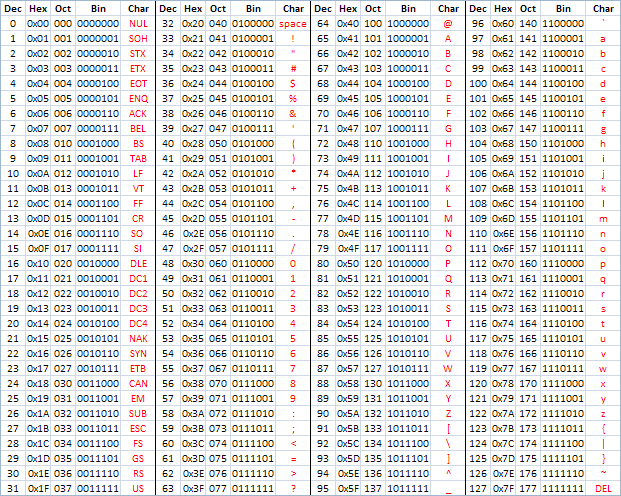

# ASCII
- A standard character-to-number [encoding](encoding.md) widely used in the computer industry. See also: [EBCDIC](ebcdic.md). [^1] #glossary

- American Standard Code for Information Interchange

## My Notes
[Notes](mynotes/ascii-notes.md)

[^1]: [ref20240211T163156](references.md#20240211T163156)